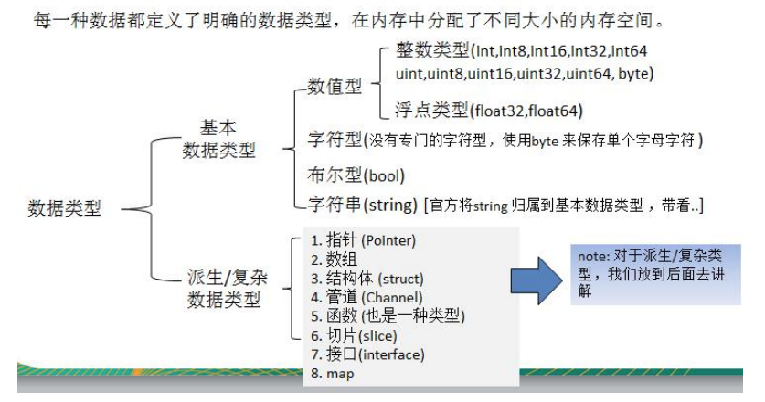

# go-lab
go练习

## 开发环境搭建
### 环境变量
GOROOT  go的目录
PATH    把bin目录添加到系统path
GOPATH  工作目录

### vscode tool被墙 更改代理
$ go env -w GO111MODULE=on
$ go env -w GOPROXY=https://goproxy.io,direct

### 安装以下14个插件
Installing 14 tools at GOPATH
  gocode
  gopkgs
  go-outline
  go-symbols
  guru
  gorename
  gomodifytags
  goplay
  impl
  godef
  goreturns
  golint
  gotests
  dlv

Installing github.com/nsf/gocode SUCCEEDED
Installing github.com/uudashr/gopkgs/cmd/gopkgs SUCCEEDED
Installing github.com/ramya-rao-a/go-outline FAILED
Installing github.com/acroca/go-symbols FAILED
Installing golang.org/x/tools/cmd/guru FAILED
Installing golang.org/x/tools/cmd/gorename FAILED
Installing github.com/fatih/gomodifytags SUCCEEDED
Installing github.com/haya14busa/goplay/cmd/goplay SUCCEEDED
Installing github.com/josharian/impl FAILED
Installing github.com/rogpeppe/godef SUCCEEDED
Installing sourcegraph.com/sqs/goreturns FAILED
Installing github.com/golang/lint/golint FAILED
Installing github.com/cweill/gotests FAILED
Installing github.com/derekparker/delve/cmd/dlv SUCCEEDED

注意：安装这些插件之前需要去github官网中下载对应的库，然后根据错误提示去GOPATH中的src目录中创建对应的目录（文件夹）即可。然后再次安装就会成功


###  常见dos命令
- md 创建目录
- cd 跳转目录
- rd 删除目录
  
  >  rd /q/s 删除目录不带询问   /s目录及一下的子目录
- 文件相关操作
  > copy 
  > echo   --- new file or append. for example: echo //lovego > b.txt        echo生成的文件会有点问题，不建议使用
  > move 
  > del
- cls   clear screen
- exit

##  base key of go
### datatype


变量的声明：

a := 10        类型推断、也算是直接声明

a :=   "你好呀aaaa"   中文是两个btte,英文是一个。底层是utf-8编码

r := []rune(str2)  字符串变量，同时处理有中文的问题


### 对指针的理解

指针就是开辟一个内存空间，里面去存放需要的目标元素的地址。

ptr  ->  [add] -> [target]


### 值类型和引用类型

值类型： int  float   bool string  数组  结构体

堆区、栈区

string  字符串底层是  byte类型


### 格式化输出

Printf("%d",n)

这些格式需要记录一下   %d   %c  %v


### 字符串处理

字符串查找   strings.Contains("xxxexx","xex")   //true

字符串统计  strings.Count("chinaaa","a")   //3

strings.Index

strings.EqualFold   不区分大小写的比较

strings.Replace(str,  "go", "北京"，-1)   //最后的n是代表替换几个，-1为全部替换

strings.Split(str, ",")

strings.ToLower("Go")

strings.ToUpper("Go")

strings.Trim()   还有TrimLeft()...


### 时间和日期

now := time.Now()     

>  time.Now().Month()   //Day()   Hour()   Second()...

时间格式化转化

now.Format("2006/01/02 15:04:05")      //记忆2006 12345

Format("2006-01-02")

time.Sleep(100 * Millisecond)

now.Unix() 

now.UnixNano()   //时间戳


### 内置函数

len

new 分配内存，主要是值类型

> num := new (int)   
>
> num -> [add] -> [value]

make    分配内存。主要是引用类型   比如chan  map slice


### 错误处理

不是传统的try catch finally

defer panic  recover

go中可以抛出一个panic的异常，然后在defer中通过recover捕获。

错误处理的作用：程序发生错误的时候，捕获后程序继续运行.如果加入预警代码，就可以让程序更加健壮

```
func test() {
	defer func() {
		if err := recover(),err != nil {
			fmt.Println("err=", err)
		}
	}()   //立即执行函数
	errhandle :=  10 / 0
	fmt.Println("errhandle=", errhandle)
}
```

自定义错误：

 1. errors.New("错误说明")

 2. panic 内置函数，接受一个interface{}类型的值

    >  if err != nil {
    >
    > ​	panic(err)
    >
    > }


### 数组

intArr  := [3]int   数组的元素默认值这个时候为0   string为""，bool的可以想到

数组的地址是连续的。数组的第一个元素就是数组的首地址

> 为什么快排比堆排更快，因为快排的比较是连续性的，更有利于cpu的缓存命中，局部性原理
>
> 堆排的比较是跳着的，其数组索引不是连续的

元素的地址间隔是跟据数组的类型决定的。int64 -> 8字节

几种数组初始化的方式：

a := [...]string{"tom","jack","mary"}   

a := [...]string{1:"tom",0:"jack",2:"mary"}     可以定义下标

遍历： 常规遍历，和for i, v :range 遍历

注意：

	1. go中数组类型是值类型，默认情况下是值传递，会进行值拷贝。数组间互不影响。需要改变，使用引用传递
 	2. 长度是固定的
 	3. 切片的底层是底部实现了一个数组。切片三要素，地址、长度、容量


### 类型转换

n, err := strcov.Atoi("123")     //字符串转整数

str = strconv.Itoa(12345)       //整数转字符串

[]byte = []byte("hello")

str = string([]byte{97,98,99})

10进制转2、8、16进制


### 标识符

大写公开、小写私有

不能以数字开头


### 运算符

++ --只能单独使用

<<=左移后赋值 c=c<<2

^异或运算符

明确不支持3元运算符


### 键盘输入

fmt.Scanln()

fmt.Scanf()


### 进制

0开头8进制

0x开头16进制

原码补码反码  还有溢出，高精度和低精度之间的转化


### 流程控制

switch 匹配项后面不需要加break

case后面的表达式可以有多个，用，间隔

fallthrough 穿透  默认穿透一层

优秀实践    switch i := x.(type)

break 和  continue的区别

break跳出整个循环，continue结束本次循环

goto   label: statement

return  跳出所在方法或函数


### for循环

for 不需要加（）  if也是不需要（）

for  key,value  :range list 语法，可以类比于for  of

没有do while  利用break 和if ，提前if和落后if


### 随机数生成

需要生成一个随机额种子，不然返回的值总是固定的

rand.Seed(time.Now().Unix())


### 包的封装

默认gopath 的src下进行进行引入。

可以给包取别名   别名  “路径”

可执行的包，需要声明为main

 

### loose ending

fmt.Printf()  格式化输出 
字符-》 对应码值 -》 二进制 -> 存储  go字符编码统一为utf-8

数据转换严格，需要同一种格式

基本类型转string    

>  Sprintf("%d,f,t,c",表达式)
>
> use strcov package:   strconv.FormatInt(...)
>
> strconv.ParseInt()


## 进阶

chan 反射  切片

### 闭包

闭包就是一个函数和其相关的引用环境组合的一个整体。其实和js中的闭包含义差不多。维持了对变量的引用


### defer

在一些资源的创建后，数据库链接、文件句柄、锁等，及时的释放资源，不用程序员去操心释放的时机

当执行到defer时，会把其后面的表达式压入到独立的栈，所以他们的执行顺序是先defer的后执行

```
func test() {
	connect = openDatabase()
	defer connect.close()
}
```


### 函数参数

go里面的值类型默认是值传递，引用类型默认引用传递。

> 引用传递的是地址的拷贝

值类型： int float bool string 数组  结构体

引用类型：  指针、slice切片  、  map 、 管道chan interfacer 

如果希望函数内的变量能修改函数外的变量，可以传入变量的地址，函数内以指针的方式操作变量。

```
func swap(*a, *b) {
	temp := *a
	*a = *b
	*b = temp
}
swap(&a, &b)
```

> 引用类型再解释
>
> ref -> [add] ->[value]  如果没有任何变量引用这个地址的时候，该地址对应的数据空间就成为一个垃圾，由GC来回收


### 变量作用域

都差不多，和js差不多